# Hibernate - Spring Data Many-to-Many

Ce projet explore la gestion d’une relation **Many-To-Many** entre utilisateurs et rôles. Il utilise Spring Boot, JPA/Hibernate et expose une API REST simple.

## Introduction

Dans ce projet, nous explorons la gestion des relations complexes entre entités dans un système d’information. L’objectif est de comprendre et de mettre en œuvre une relation **Many-To-Many** entre utilisateurs et rôles. Le projet illustre aussi la cohérence des données et l’importance d’une architecture maintenable.

## Objectifs

Les objectifs de ce projet sont :

- Créer un système flexible et robuste de gestion des utilisateurs et des rôles.  
- Implémenter une relation **Many-To-Many** avec JPA/Hibernate.  
- Assurer la cohérence des données via des transactions Spring et Hibernate.  
- Exposer les fonctionnalités via une API REST sécurisée.

## Technologies utilisées 

| Technologie       | Rôle                                                             |
|-------------------|------------------------------------------------------------------|
| Spring Boot       | Socle d’une application extensible et maintenable               |
| Spring Data JPA   | Simplification de l’accès aux données et exécution des requêtes  |
| Hibernate         | ORM et gestion des relations **Many-To-Many**                    |
| H2 Database       | Base légère pour tests et environnement reproductible            |
| Lombok            | Réduction du code répétitif et amélioration de la lisibilité     |
| Spring Web REST   | Exposition d’API REST claires et fonctionnelles                  |

## Architecture

Le projet suit le principe de séparation des responsabilités :

- Les **repositories** gèrent la persistance et la récupération des entités.  
- Les **services** contiennent la logique métier.  
- Les **entités** représentent les données et leurs relations.  

Cette organisation rend le code modulaire, lisible et facilement extensible.

## Entités

### User

L’entité **User** représente un utilisateur du système.  
- Identifiant unique (UUID)  
- Nom d’utilisateur  
- Mot de passe  
- Relation **Many-To-Many** avec **Role**  

### Role

L’entité **Role** définit un niveau d’autorisation.  
- Identifiant unique  
- Nom du rôle  
- Relation **Many-To-Many** avec **User**

### Table d’association

La table **USERS_ROLES** est générée par Hibernate.  
Elle lie les utilisateurs et les rôles sans compromettre l’intégrité des données.

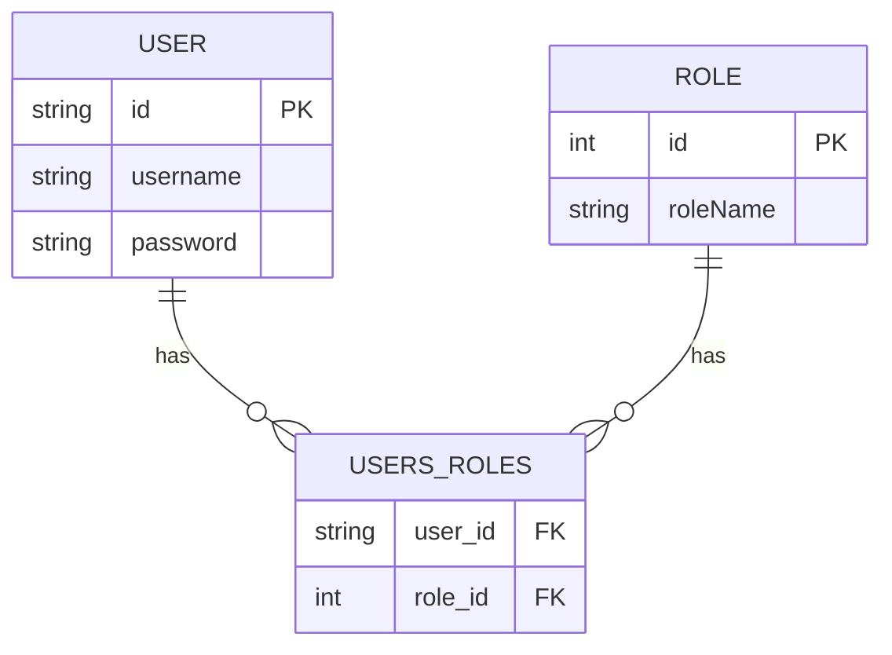

## Philosophie de conception

La conception repose sur quatre principes :

- **Cohérence des données**** :** transactions gérées par Spring et Hibernate.  
- **Séparation des responsabilités** :** code propre et maintenable.  
- **Extensibilité** :** ajout d’entités sans impact majeur.  
- **Simplicité et clarté** :** dans le code et les interfaces.

## Fonctionnalités

Le projet offre plusieurs fonctionnalités clés :

- Création et suppression d’utilisateurs et de rôles.  
- Association et dissociation simples d’entités **User** et **Role**.  
- Authentification par nom d’utilisateur et mot de passe.  
- Consultation des utilisateurs et de leurs rôles via un endpoint REST.

## API

### GET /users/{username}

```api
{
  "title": "Récupérer un utilisateur",
  "description": "Permet de récupérer un utilisateur et ses rôles associés par nom d’utilisateur.",
  "method": "GET",
  "baseUrl": "http://localhost:8080",
  "endpoint": "/users/{username}",
  "pathParams": [
    {
      "key": "username",
      "value": "Nom d’utilisateur",
      "required": true
    }
  ],
  "headers": [
    {
      "key": "Authorization",
      "value": "Bearer <token>",
      "required": false
    }
  ],
  "bodyType": "none",
  "responses": {
    "200": {
      "description": "Succès",
      "body": "{\n  \"userId\": \"...\",\n  \"userName\": \"user1\",\n  \"roles\": [\n    {\"id\": 1, \"roleName\": \"STUDENT\"},\n    {\"id\": 2, \"roleName\": \"USER\"}\n  ]\n}"
    },
    "404": {
      "description": "Utilisateur non trouvé",
      "body": "{\n  \"error\": {\"message\": \"User not found\"}\n}"
    }
  }
}
```

## Exécution

Pour lancer le projet :

1. Cloner le dépôt :  
   ```bash
   git clone https://github.com/votre-repo/Hibernate_Spring_Data_Many_To_Many_Case.git
   ```
2. Ouvrir le projet dans un IDE compatible Maven.  
3. Installer les dépendances :  
   ```bash
   mvn install
   ```
4. Démarrer l’application :  
   ```bash
   mvn spring-boot:run
   ```
5. Consulter la console H2 : http://localhost:8080/h2-console  
6. Tester les endpoints via Postman ou un navigateur.

## Captures d’écran
| a | b |
|---|---|
| 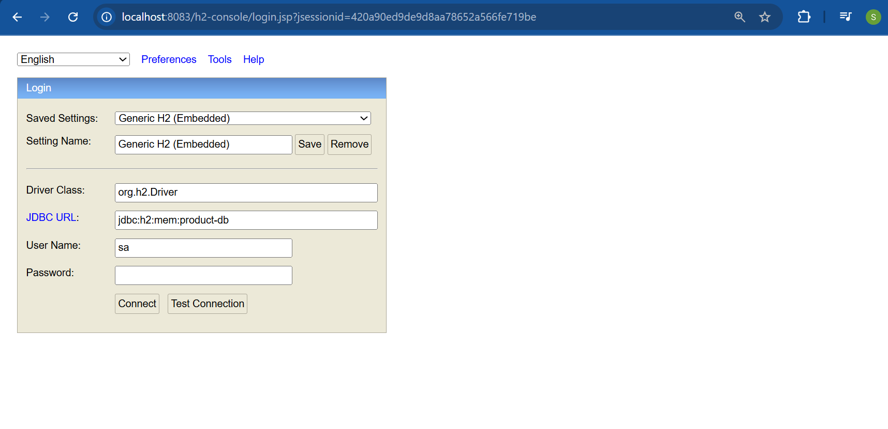 | 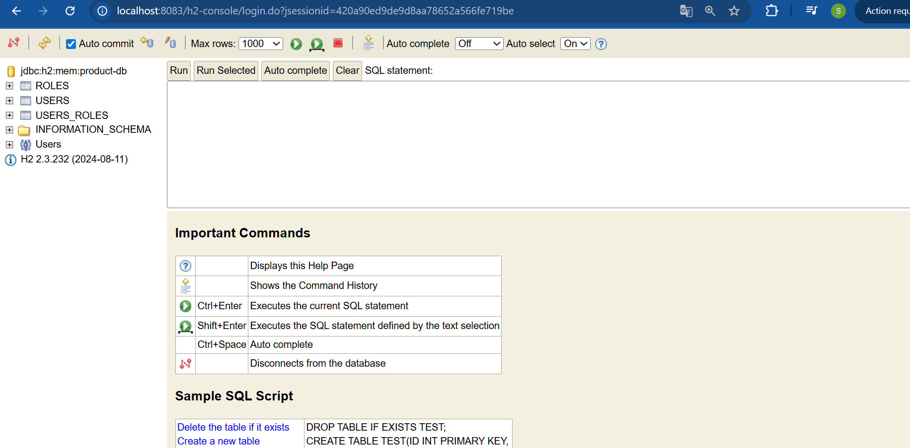 |

| c | d |
|---|---|
| 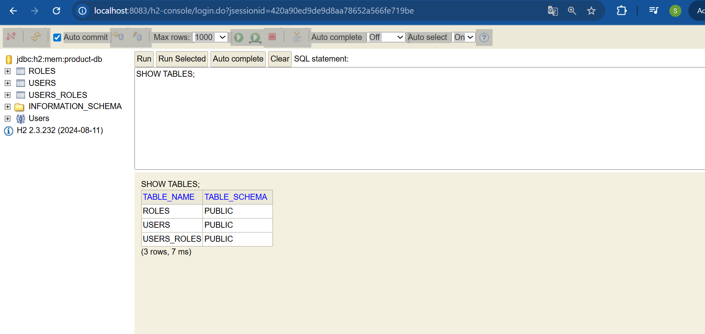 | 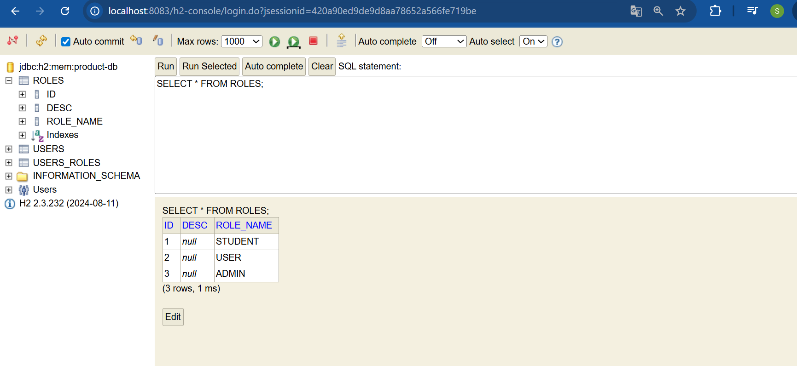 |

| e | f |
|---|---|
| 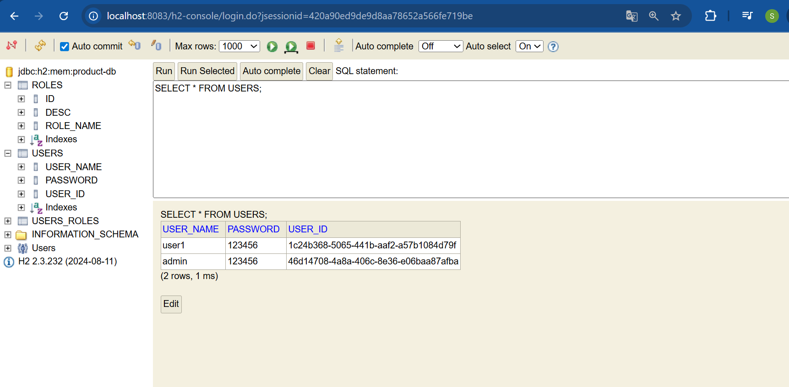 | 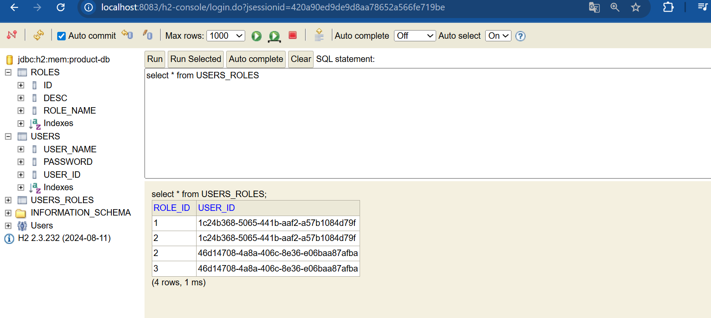 |

| g | h |
|---|---|
| 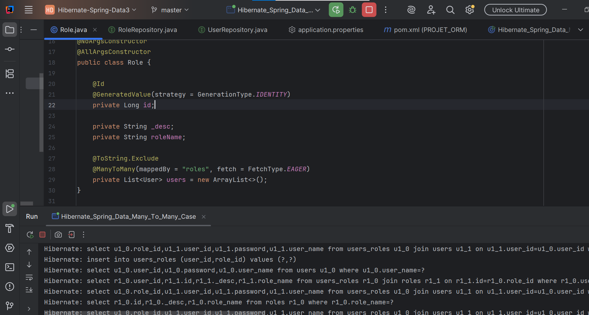 | 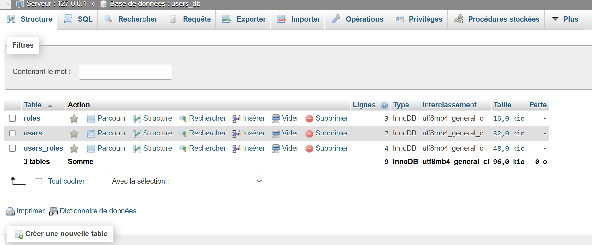 |

| i | j |
|---|---|
| 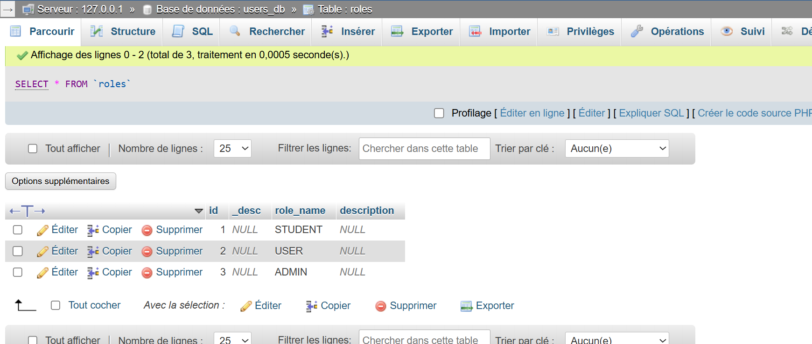 | 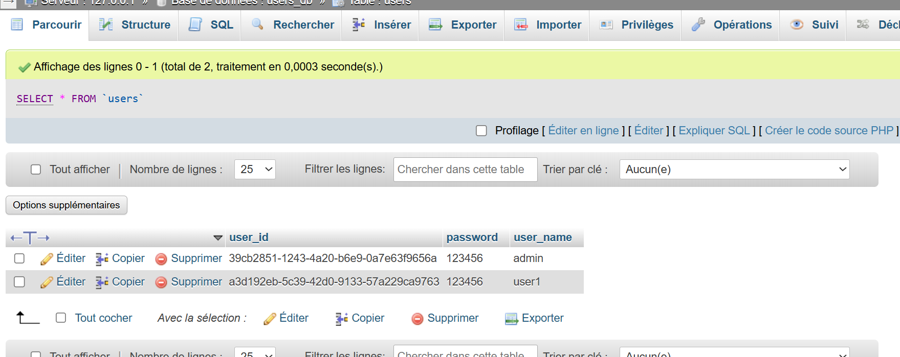 |

| k | l |
|---|---|
| 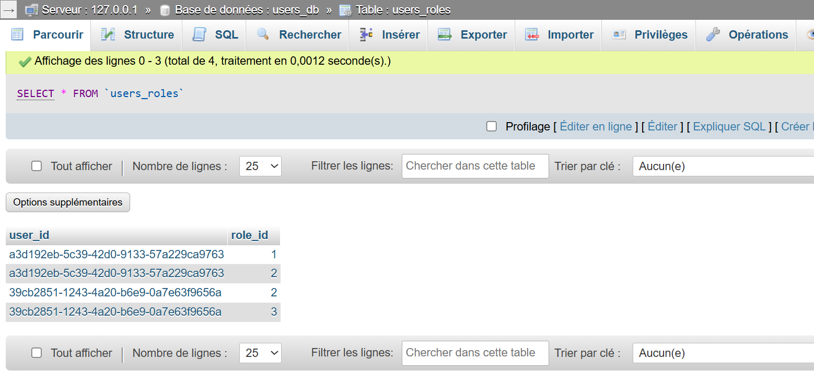 |  |


## Conclusion 

Ce projet démontre la puissance des relations **Many-To-Many**, la gestion des transactions et la séparation des responsabilités. Il offre une base solide pour des évolutions futures requérant un contrôle précis des accès et une gestion efficace des entités liées.
